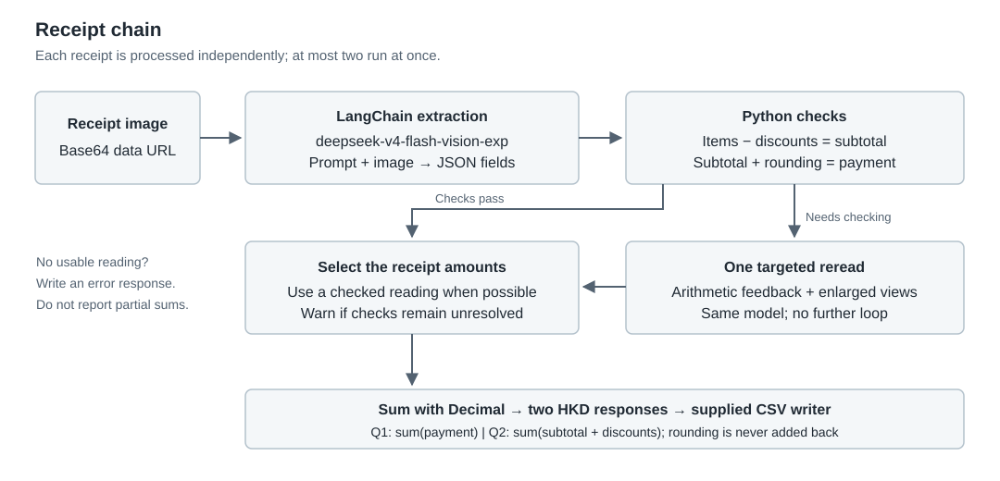

# FTEC5660 Homework 1: Receipt Chain

Build a LangChain pipeline that reads every supermarket receipt in a folder
with the vision-capable DeepSeek Flash model and answers these two questions:

1. How much money did I spend in total for these bills?
2. How much would I have had to pay without the discount?

For this homework, **amount spent** means the final payment after the receipt's
rounding line. **Without the discount** means the sum of the original positive
item prices: add back every promotion, coupon, member, app, packaging-damage,
and percentage discount, but do not add back rounding.

## Student task

Only edit the two functions in `hw1.py` that contain `### YOUR CODE HERE`:

- `build_chain()` creates your LangChain chain.
- `answer_queries()` runs the chain on the receipt images and returns one final
  response for each question.

You may use prompt chaining, routing, parallel calls, reflection, or a
combination. Your final responses should each contain one HKD amount. Do not
hard-code filenames or public answers; grading uses unseen receipt folders.

## Setup and public test

```bash
python3 -m venv .venv
source .venv/bin/activate
pip install -r requirements.txt
```

Put your DeepSeek key after `DEEPSEEK_API_KEY=` in `.env`, then run:

```bash
python3 hw1.py --image-folder public_test
```

The program creates `results.csv` in the current directory. Its columns are
`query`, `model_response`, and `correctness`. The public answers are in
`public_test/ground_truth.json`. The starter intentionally returns the dummy
response `please design your chain to answer these two queries.` so it runs
before you add any API code.

The required model is `deepseek-v4-flash-vision-exp`, the vision-capable
DeepSeek Flash model. JPEG, PNG, GIF, and WebP inputs are accepted by the
homework runner.


## Homework 1 solution: 


I process one receipt at a time using a LangChain prompt, `ChatDeepSeek` with
`deepseek-v4-flash-vision-exp`, and a text output parser. The prompt asks for
structured JSON containing the original item line totals, each discount,
subtotal, signed rounding and final payment. It distinguishes cash tendered
from net payment, and excludes rounding from discounts. Python then uses
`Decimal` to check whether the items minus discounts equal the subtotal and
whether subtotal plus rounding equals payment. A malformed or inconsistent
reading gets one more attempt with feedback and enlarged, overlapping views
of the same image. This helped with small printed digits that were misread in
the full image. I limit processing to two receipts at a time and only reread
the ones that need it. Finally, Python sums each receipt's payment for the
first question, and its subtotal plus all discount amounts for the second.
The model does not calculate the folder totals. Each answer contains one
amount formatted as `HK$0.00`. The supplied runner and scoring functions are
unchanged; the chain never reads `ground_truth.json` or relies on filenames.

### Checks and limitations

An initial public test got the payment total right but missed one dollar in
the undiscounted total because a printed discount digit was misread. Adding
enlarged views to the second pass corrected that reading. Final validation
results are recorded in `VALIDATION.md`.

The API timeout is 60 seconds per request, with at most one SDK retry and one
additional extraction attempt per receipt. Most receipts use one model call.
The second attempt includes the original image and up to three enlarged views;
the prompt explicitly says that these show the same receipt. If both readings
remain inconsistent, the code uses the reading with fewer failed checks and
prints a warning. This is a best-effort fallback, not a guarantee of accuracy.
If no usable reading is available, it returns an explicit failure message so
the runner can still write `results.csv`, instead of reporting a partial total
as though it covered the folder. Such a run is not a successful submission.

### Running locally

Use Python 3.10 or later and the dependencies in `requirements.txt`. Pillow is
used only to prepare enlarged views on the second pass. Keep the API key in a
local `.env` file or the `DEEPSEEK_API_KEY` environment variable. Never commit
the real key. Run from the repository root:

```bash
python hw1.py --image-folder public_test
```

Check that **both** rows in `results.csv` say `correct`. The expected public
totals are supplied by the teacher in `public_test/ground_truth.json`.
Passing this small public set does not establish accuracy on unseen receipts.
